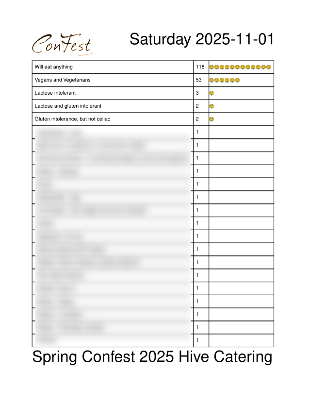

# Hive Catering Export
A web app to import live dietary info and allergies of volunteers from google sheets and export a printable PDF of the daily catering requirements at Spring Confest 2025 (Hive is the name of the volunteer crew kitchen). 
# Usage
The exported PDFs will be printed off and laminated to support the Hive kitchen crew for better meal planning each day. The dietary info for each day is on a separate page.
# Example page of the PDF

# Deployment and installation instructions
This app is provided as-is with no promises of support. The backend runs in Express JS with googleapis for authentication and pdfkit for the generated PDF. The frontend runs in Typescript, Vite and React. 